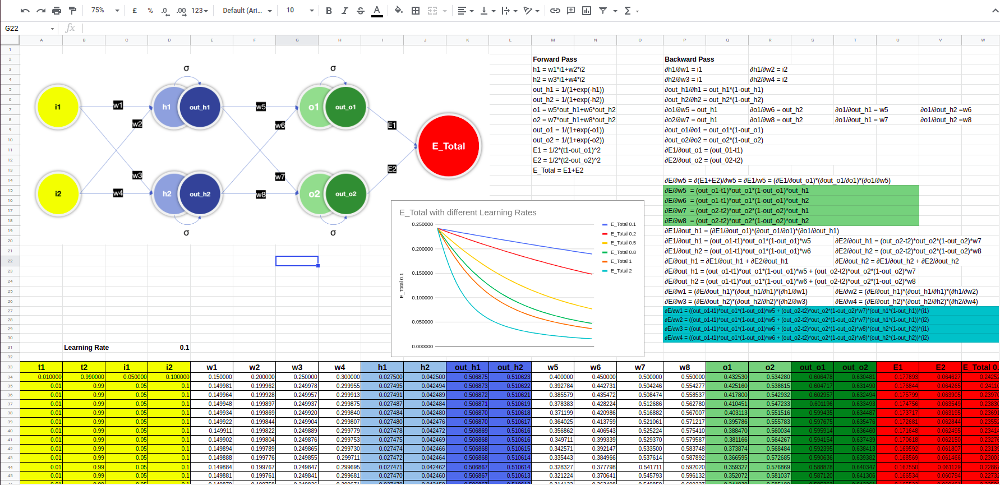
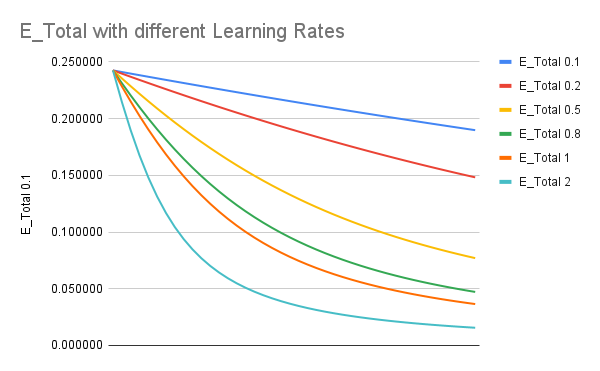

# TSAI - S4
## Screenshot of excel sheet

## Major Steps 
#### Calcualate Forward Pass
| h1 = w1*i1+w2*i2         |      |
| ------------------------ | ---- |
| h2 = w3*i1+w4*i2         |      |
| out_h1 = 1/(1+exp(-h1))  |      |
| out_h2 = 1/(1+exp(-h2))  |      |
| o1 = w5*out_h1+w6*out_h2 |      |
| o2 = w7*out_h1+w8*out_h2 |      |
| out_o1 = 1/(1+exp(-o1))  |      |
| out_o2 = 1/(1+exp(-o2))  |      |
| E1 = 1/2*(t1-out_o1)^2   |      |
| E2 = 1/2*(t2-out_o2)^2   |      |
| E_Total = E1+E2          |      |

#### Calculate all steps of derivatives of backward pass

| ∂h1/∂w1 = i1 | ∂h1/∂w2 = i2 |
| ------------ | ------------ |
| ∂h2/∂w3 = i1 | ∂h2/∂w4 = i2 |

| ∂out_h1/∂h1 = out_h1*(1-out_h1) |
| ------------------------------- |
| ∂out_h2/∂h2 = out_h2*(1-out_h2) |

| ∂o1/∂w5 = out_h1 | ∂o1/∂w6 = out_h2 | ∂o1/∂out_h1 = w5 | ∂o1/∂out_h2 =w6 |
| ---------------- | ---------------- | ---------------- | --------------- |
| ∂o2/∂w7 = out_h1 | ∂o1/∂w8 = out_h2 | ∂o1/∂out_h1 = w7 | ∂o1/∂out_h2 =w8 |

| ∂out_o1/∂o1 = out_o1*(1-out_o1) |
| ------------------------------- |
| ∂out_o2/∂o2 = out_o2*(1-out_o2) |
| ∂E1/∂out_o1 = (out_01-t1)       |
| ∂E2/∂out_o2 = (out_02-t2)       |

#### Calculate the derivative w.r.t weights using chain rule

##### Derivatives for w5,w6,w7,w8

| ∂E/∂w5 = ∂(E1+E2)/∂w5 = ∂E1/w5 = (∂E1/∂out_o1)*(∂out_o1/∂o1)*(∂o1/∂w5) |
| ------------------------------------------------------------ |
| ∂E/∂w5  = (out_o1-t1)*out_o1*(1-out_o1)*out_h1               |
| ∂E/∂w6  = (out_o1-t1)*out_o1*(1-out_o1)*out_h2               |
| ∂E/∂w7  = (out_o2-t2)*out_o2*(1-out_o2)*out_h1               |
| ∂E/∂w8  = (out_o2-t2)*out_o2*(1-out_o2)*out_h2               |

##### Derivatives for w1,w2,w3,w4

| ∂E/∂w1 = ((out_o1-t1)*out_o1*(1-out_o1)*w5 + (out_o2-t2)*out_o2*(1-out_o2)*w7)*(out_h1*(1-out_h1))*(i1) |
| ------------------------------------------------------------ |
| ∂E/∂w2 = ((out_o1-t1)*out_o1*(1-out_o1)*w5 + (out_o2-t2)*out_o2*(1-out_o2)*w7)*(out_h1*(1-out_h1))*(i2) |
| ∂E/∂w3 = ((out_o1-t1)*out_o1*(1-out_o1)*w6 + (out_o2-t2)*out_o2*(1-out_o2)*w8)*(out_h2*(1-out_h2))*(i1) |
| ∂E/∂w4 = ((out_o1-t1)*out_o1*(1-out_o1)*w6 + (out_o2-t2)*out_o2*(1-out_o2)*w8)*(out_h2*(1-out_h2))*(i2) |

### Train Loop

Update the weights with respect to the learning rates and derivatives calculated. 

#### Error Graphs for different learning rates

lr = [0.1, 0.2, 0.5, 0.8, 1.0, 2.0]

